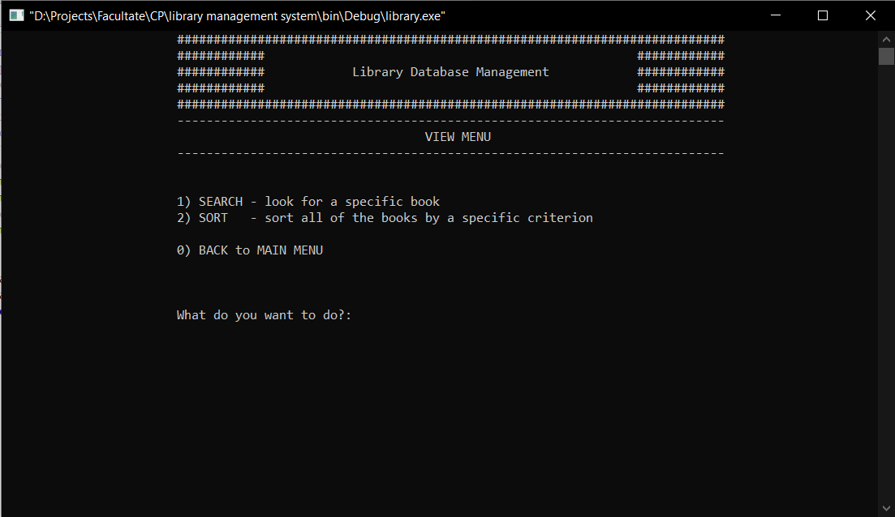
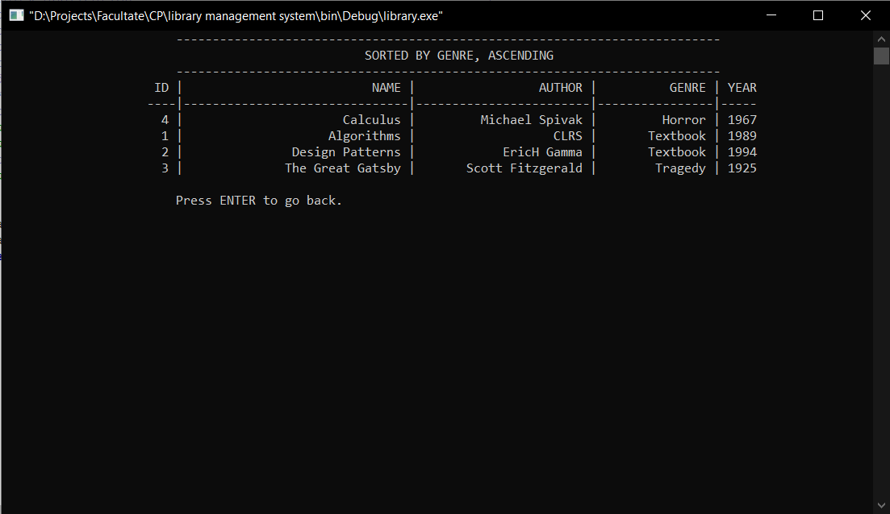
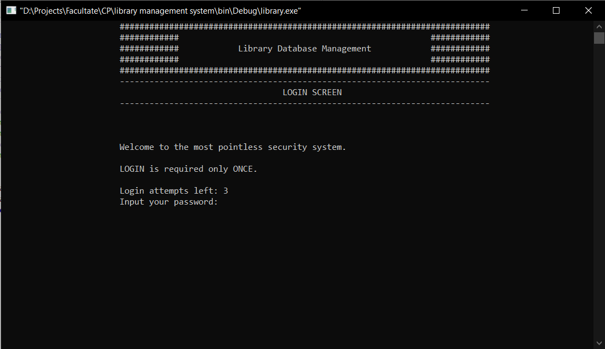
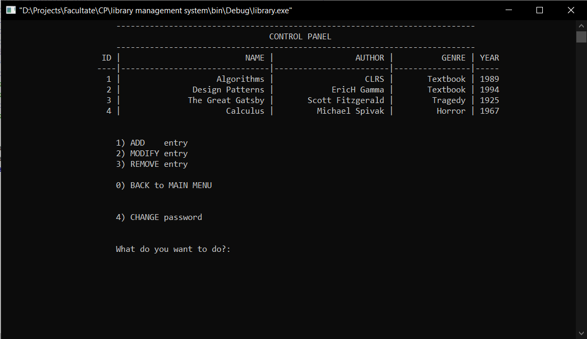

<!-- Improved compatibility of back to top link: See: https://github.com/othneildrew/Best-README-Template/pull/73 -->

<!--
*** Thanks for checking out the Best-README-Template. If you have a suggestion
*** that would make this better, please fork the repo and create a pull request
*** or simply open an issue with the tag "enhancement".
*** Don't forget to give the project a star!
*** Thanks again! Now go create something AMAZING! :D
-->

<!-- PROJECT SHIELDS -->
<!--
*** I'm using markdown "reference style" links for readability.
*** Reference links are enclosed in brackets [ ] instead of parentheses ( ).
*** See the bottom of this document for the declaration of the reference variables
*** for contributors-url, forks-url, etc. This is an optional, concise syntax you may use.
*** https://www.markdownguide.org/basic-syntax/#reference-style-links
-->
[![Cosmin][linkedin-cosmin-shield]][linkedin-cosmin-url]
[![Monika][linkedin-monika-shield]][linkedin-monika-url]
[![Monika][github-monika-shield]][github-monika-url]

<!-- PROJECT LOGO -->
 

  

<h3 align="center">Library Management System</h3>

  

    Console-based library management using dynamic memory
     
     
     
  

<!-- TABLE OF CONTENTS -->

  
Table of Contents

  <ol>
    <li>
      <a href="#about-the-project">About The Project</a>
      <ul>
        <li><a href="#built-with">Built With</a></li>
      </ul>
    </li>
    <li><a href="#usage">Usage</a></li>
  </ol>

<!-- ABOUT THE PROJECT -->
## About The Project

[![Library Management System Screenshot][product-screenshot]](https://github.com/ciomin/library-management-system)

This Library Management System is a tool designed to manage and streamline the organization of a library's resources. Developed with C, the system features dynamic memory allocation, which ensures efficient management of memory for operations that deal with a variable number of books. Users can interact with a user-friendly menu-driven interface to add, modify, or remove book entries in the database, which are stored in a binary file format.

Key functionalities include searching for books by various attributes like ID, name, author, or year; sorting books based on these attributes in both ascending and descending order; and user authentication features for secure access to the system’s editing capabilities. The system also supports password management, allowing users to reset or change their passwords as needed.

(<a href="#readme-top">back to top</a>)

### Built With

* ![C][C]

(<a href="#readme-top">back to top</a>)

<!-- USAGE EXAMPLES -->
## Usage

From the main menu, users can choose to either "View" or "Edit" the library's database. Selecting "Edit" accesses the ADMINISTRATOR dashboard, which is secured by a LOGIN screen.

### View Menu
Users can search for books by NAME, AUTHOR, GENRE, or YEAR PUBLISHED. It is also possible to sort the book entries by ID, NAME, AUTHOR, GENRE, or YEAR PUBLISHED in either ASCENDING or DESCENDING order.

### Sort Menu
Here is an example of sorting books by GENRE in ASCENDING order:

### Login Screen
The authentication system is designed for simplicity; hence, the password will automatically reset to `admin` after three unsuccessful login attempts.

### Administrator Panel
Administrators have the ability to ADD, EDIT, or REMOVE entries from the database. All data is securely stored in binary file format.

(<a href="#readme-top">back to top</a>)

<!-- MARKDOWN LINKS & IMAGES -->
<!-- https://www.markdownguide.org/basic-syntax/#reference-style-links -->
[linkedin-cosmin-shield]: https://img.shields.io/badge/-Cosmin-black.svg?style=for-the-badge&logo=linkedin&colorB=555
[linkedin-cosmin-url]: https://linkedin.com/in/cosmin-iacobut
[linkedin-monika-shield]: https://img.shields.io/badge/-Monika-black.svg?style=for-the-badge&logo=linkedin&colorB=555
[linkedin-monika-url]: https://www.linkedin.com/in/monika-bokotey-b9b431253/
[github-monika-shield]: https://img.shields.io/badge/-Monika-black.svg?style=for-the-badge&logo=github
[github-monika-url]: https://github.com/MonikaBokotey
[product-screenshot]: images/menu.png
[C]: https://img.shields.io/badge/C-eeeeee?style=for-the-badge&logo=c
